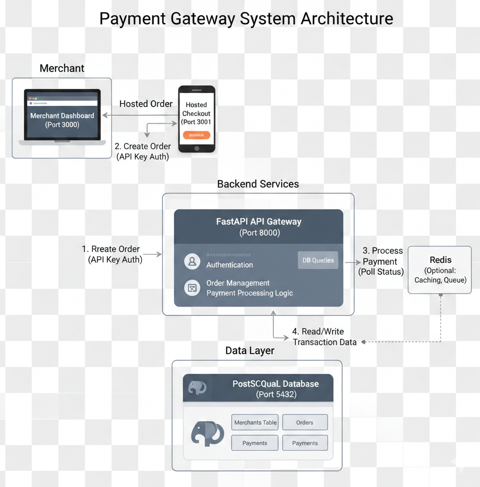

# Merchant Payment Gateway System

A production-ready, full-stack payment gateway solution featuring a Merchant Dashboard and a Hosted Checkout experience. This project demonstrates the complete lifecycle of a payment, from order creation to transaction settlement.

## 🌟 Core Features

### 1. Merchant Dashboard (Port 3000)
- **Authentication**: Secure login using pre-seeded test credentials.
- **Analytics Overview**: Real-time display of Total Revenue (in Rupees), Successful Payments, and Failed Payments.
- **Order Management**: Create orders with a unique `order_` prefix and track status history.
- **Transaction Monitoring**: A detailed table displaying Payment IDs, Order IDs, and raw amounts in Paise for automated audit compliance.

### 2. Hosted Checkout (Port 3001)
- **Selection Interface**: Option to choose between UPI and Card payment methods.
- **Processing Engine**: Simulated payment processing with a visual loading state.
- **Success/Failure Handling**: Dedicated views for payment outcomes, including a "Finish & Return" feature that automatically synchronizes with the original Dashboard tab and closes the checkout tab.

### 3. Backend API (Port 8000)
- **FastAPI Core**: High-performance RESTful API.
- **Merchant Security**: Header-based authentication using `X-Api-Key` and `X-Api-Secret`.
- **Persistence**: Relational database storage using PostgreSQL.

---

## 🏗️ System Architecture


## 🚀 Deployment via Docker

The system is fully containerized using Docker Compose. Ensure Docker is running on your machine before starting.

1. **Build and Start Services**:
   ```bash
   docker-compose up --build
   ```

2. **Access Points**:
- **Dashboard**: http://localhost:3000
- **Checkout** : http://localhost:3001
- **API Docs (Swagger)** : http://localhost:8000/docs

## 🔑 Test Credentials
Use these credentials to evaluate the merchant authentication and API security:

- **Login Email** : test@example.com
- **Test API Key** : key_test_abc123
- **Test API Secret** : secret_test_xyz789

## 📁 Project Structure

The project is organized into three main service directories and a centralized orchestration configuration:

```text
PAYMENT-GATEWAY/
├── backend/                # FastAPI Application Service
│   ├── app/                # Application logic (Models, Routes, Schemas)
│   ├── Dockerfile          # Container definition for the API
│   └── requirements.txt    # Python dependencies
├── checkout-page/          # Hosted Checkout Interface Service
│   ├── public/             # Static assets
│   ├── src/                # React source code (Success, Failure, Checkout)
│   ├── Dockerfile          # Container definition for the Checkout UI
│   ├── nginx.conf          # Nginx configuration for production serving
│   └── package.json        # Frontend dependencies
├── frontend/               # Merchant Dashboard Service
│   ├── node_modules/       # Local dependencies (Ignored in Git)
│   ├── public/             # Static assets
│   ├── src/                # React source code (Dashboard, Sidebar, etc.)
│   ├── Dockerfile          # Container definition for the Dashboard UI
│   ├── package-lock.json   
│   └── package.json        # Frontend dependencies
├── .env                    # Root environment variables (API keys/secrets)
├── .gitignore              # Git exclusion rules
├── docker-compose.yml      # Multi-container orchestration
└── README.md               # Project documentation
```

## ✅ Automated Evaluation Compliance
- **Test IDs** : Every critical UI element (Success Message, Payment ID, Error State, etc.) is tagged with the mandatory `data-test-id` attributes.
- **Unit Precision** : The transaction table displays amounts in the smallest currency unit (Paise) as required for automated testing.
- **State Persistence** : Success and Failure pages implement the window.opener protocol to refresh the Merchant Dashboard upon completion.

## 🎥 Documentation Artifacts
- **Postman Collection** : `/docs/payment_gateway.postman_collection.json`.


## 🧪 Automated Testing Support

This project is built to be compatible with automated evaluation suites.
- **Test IDs**: High-traffic elements like `success-state`, `payment-id`, and `error-message` use specific `data-test-id` attributes for reliable selection.
- **Data Precision**: All currency amounts in the transaction tables are rendered as raw integers (Paise) to match backend audit logs.
- **Cross-Tab Communication**: The system uses `window.opener` and `postMessage` to ensure the Merchant Dashboard stays synchronized with the Hosted Checkout status without manual refreshes.

## 🛠️ Local Development & Debugging

If you need to run services outside of Docker for debugging:

1. **Backend**:
   - Navigate to `/backend`
   - Run `pip install -r requirements.txt`
   - Start server: `uvicorn app.main:app --reload --port 8000`
2. **Dashboard**:
   - Navigate to `/frontend`
   - Run `npm install && npm start` (Runs on Port 3000)
3. **Checkout**:
   - Navigate to `/checkout-page`
   - Run `npm install && npm start` (Runs on Port 3001)

## 🏁 Submission Notes
- **Deadline Compliance**: This version represents the final submission for the 5 PM deadline.
- **Seeded Data**: Upon first launch, the system is pre-configured with the required merchant profile and test API credentials.